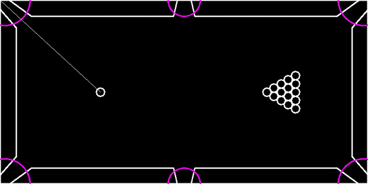
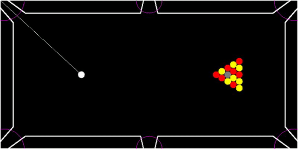
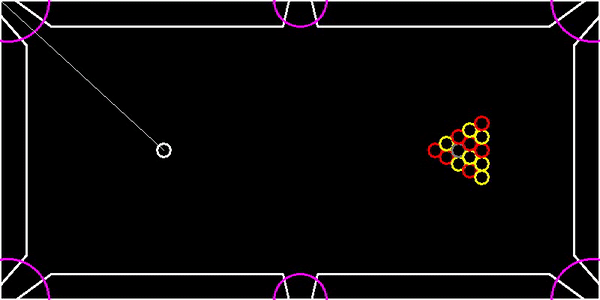
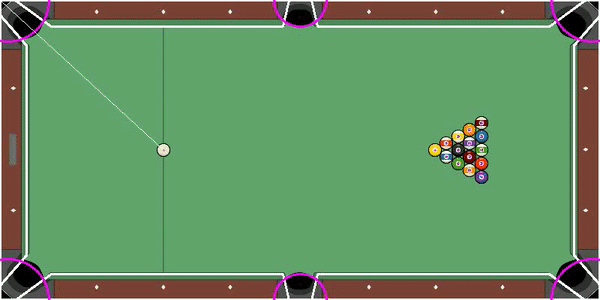
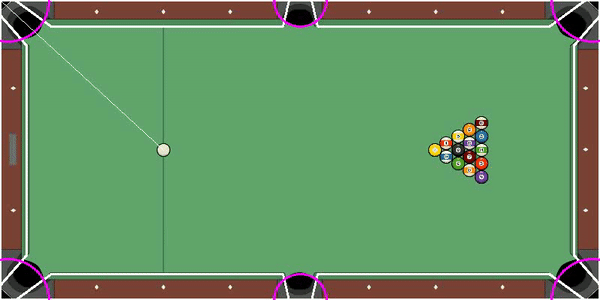
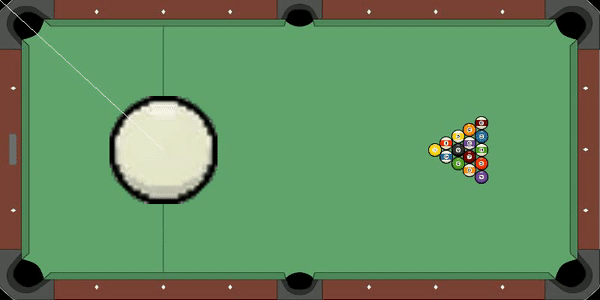

# 2D Physics engine













This program was originally made to run with SDL on Windows, and was adapted to use OPENCV. 
This is a simple physics engine that manages a few kinds of collisions mainly involving circular shapes. As a demo, a pool table was made to show its capabilities. 
The SDL version could enforce pool table rules and a simple menu system, but it is not adapted for OPENCV yet.

To compile & run the demo : 

```
cd ./Build
cmake ..
make
./2DEngine
```

(Require OPENCV and Cmake)

